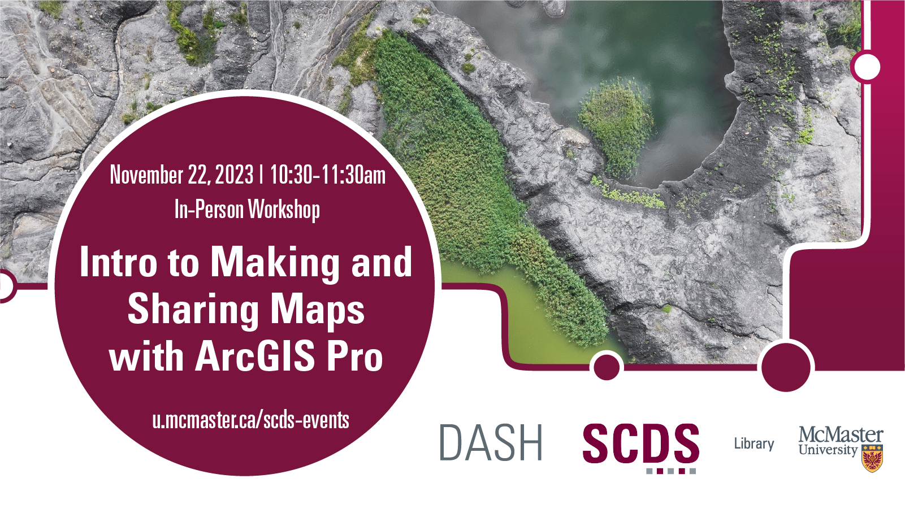

# Making and Sharing Maps with ArcGIS Pro

ArcGIS Pro is a professional desktop Geographic Information Systems (GIS) program. It is a powerful data visualization tool that maps and analyzes data, depicting patterns and trends.

This workshop is geared towards beginners new to ArcGIS or ArcMap users making the switch to ArcGIS Pro. Attendees will become familiar with ArcGIS tools that are available on campus, learn the ArcGIS Pro interface, symbolize data, and share the resulting map. 

[Register for this workshop](https://libcal.mcmaster.ca/event/3738747){: .btn .btn-outline }

## Workshop Preparation 

An ArcGIS account is required for attendees who wish to follow along with the workshop content. Accounts can be requested by completing the [ArcGIS software request form](https://docs.google.com/forms/d/e/1FAIpQLSc1NpIK3WNkWT2P92nBsBB76PDlpDa9uKn7tYi3wGO6co97eA/viewform?usp=sf_link). Please note that ArcGIS is proprietary software and complimentary access is restricted to McMaster staff, students, and faculty. Be sure to request the software at least one week ahead of the workshop and please have the program downloaded on your personal computer to use at the session.

## Facilitator Bio

Christine Homuth (she/her) is the Library's Spatial Information (GIS) Specialist, providing resources and support to the McMaster community for Geographic Information Systems and geospatial data.

<!-- # Workshop Recording

Coming Soon

# Workshop Slides

Coming Soon

# Links and Resources 

Coming Soon -->
