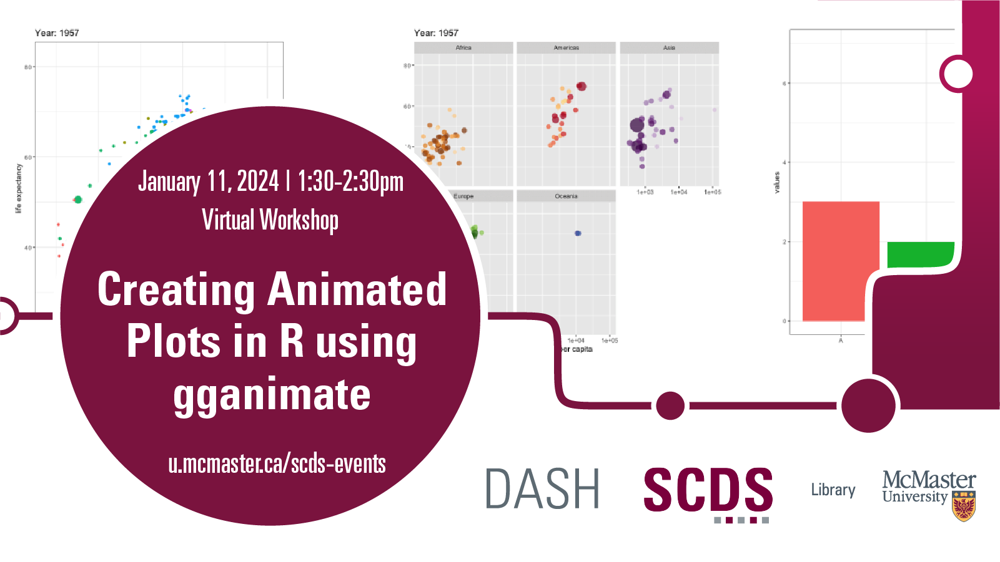

# Creating Animated Plots in R using gganimate

This virtual workshop will build on the [Fall 2023 workshop “Data Visualization in R using ggplot2”](ggplot2) to provide an introduction to gganimate in the statistical programming language R. This workshop will go examples on how to create visualizations that change over time and how to and customize the design of those graphs.

## Facilitator Bio

Subhanya Sivajothy (she/her) brings a background of research in data justice, science and technology studies, and environmental humanities. She is currently thinking through participatory data design which allow for visualizations that are empowering for the end user. She also has experience in Research Data Management—particularly data cleaning and curation. Do not hesitate to reach out to her if you would like to talk more about data analysis and visualization as they evolve throughout the research process. Email Subhanya at [sivajos@mcmaster.ca](mailto:sivajos@mcmaster.ca).

## Workshop Preparation 

Participants should attend or watch the recording of the [Fall 2023 workshop "Data Visualization in R using ggplot2"](ggplot2) before attending this session.
  
<!-- # Workshop Recording

Coming Soon

# Workshop Slides

Coming Soon

# Links and Resources 

Coming Soon -->
