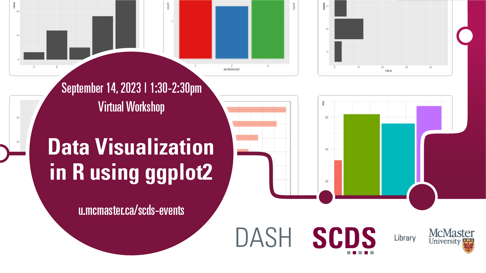

# Data Visualization in R using ggplot2

This virtual workshop will provide an introduction to ggplot2, an open-source data visualization package for the statistical programming language R. This workshop will go overbasic tips for creating visualizations and customizing the design of those graphs. A basic familiarity with R will be helpful for this workshop. 

## Facilitator Bio

Subhanya Sivajothy (she/her) brings a background of research in data justice, science and technology studies, and environmental humanities. She is currently thinking through participatory data design which allow for visualizations that are empowering for the end user. She also has experience in Research Data Management—particularly data cleaning and curation. Do not hesitate to reach out to her if you would like to talk more about data analysis and visualization as they evolve throughout the research process. Email Subhanya at [sivajos@mcmaster.ca](mailto:sivajos@mcmaster.ca). 

## Workshop Preparation 

- Download [R](https://www.r-project.org/) - *(there will be time during the workshop to download it as well)*
  
<!-- # Workshop Recording

Coming Soon

# Workshop Slides

Coming Soon

# Links and Resources 

Coming Soon -->
