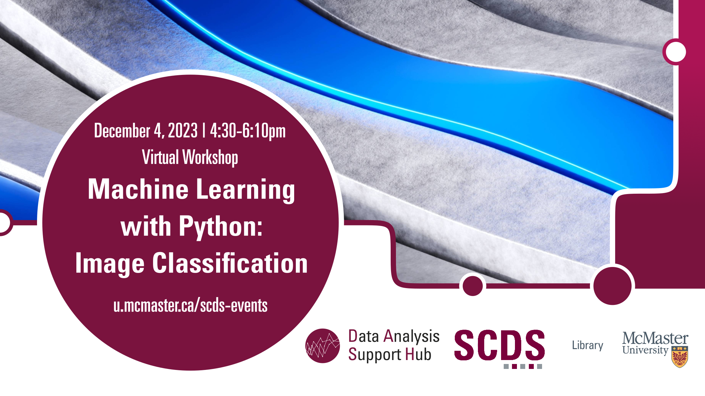

# Machine Learning with Python: Image Classification

Learn image classification at this Workshop, where we delve into image recognition using the PyTorch framework. Whether you're a novice or have some prior experience in machine learning, this workshop is tailored to help you grasp the essentials of building image classification models.

[Register for this workshop](https://libcal.mcmaster.ca/event/3761926){: .btn .btn-outline }

## Facilitator Bio

Amirreza is a Master’s student in the Electrical and Computer Engineering department of McMaster University with 8 years of experience in different programming languages.

<!-- # Workshop preparation 

Coming Soon
  
# Workshop Recording

Coming Soon

# Workshop Slides

Coming Soon

# Links and Resources 

Coming Soon -->
