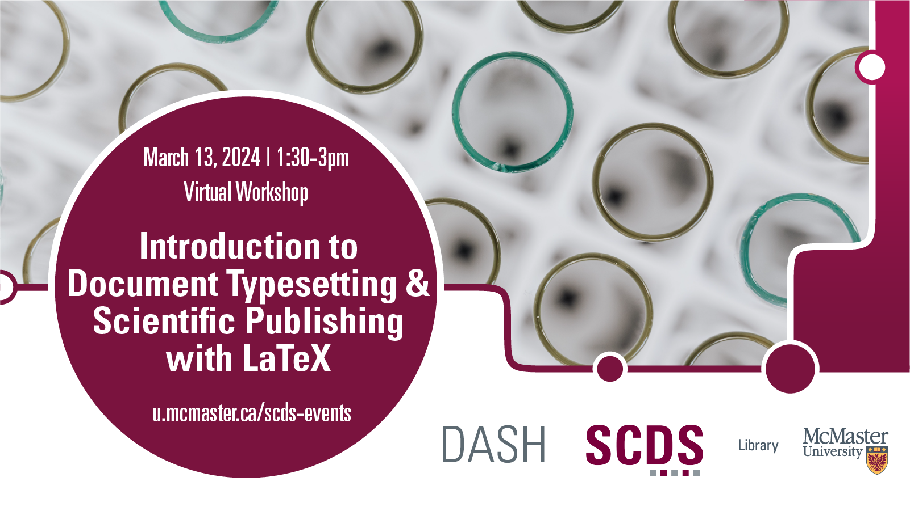

# Document Typesetting and Scientific Publishing with LaTeX

LaTeX is a typesetting programming language used to produce beautiful documents. It especially excels at scientific, mathematic, and engineering specific layouts, but can be used to produce nearly any sort of document. This workshop will teach you the basics of LaTeX, including how to render things like chemical formulas with ease.

**The recording and materials for this workshop are available here:** <https://scds.github.io/intro-latex/>

## Facilitator Bio

John Fink's (he/they) talents lie in complex and innovative systems administration and project management. He also has an interest in the maker/hacker element in digital scholarship, and is frequently spotted tinkering with esoteric hardware. If you are interested in having the Sherman Centre support your project, John is an excellent first contact.
