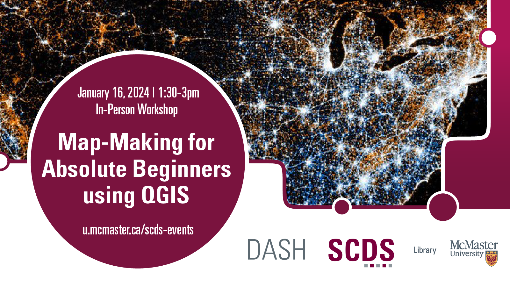

# Map-Making for Absolute Beginners using QGIS

Designed for those who are curious about making maps but haven't yet had the opportunity to learn. This workshop will provide a friendly introduction to geographic data and the mapping of this data using the geographic information system (GIS) software, QGIS. Absolutely no geography or quantitative background is necessary for an engaging experience.

[Register for this workshop](https://libcal.mcmaster.ca/event/3741146){: .btn .btn-outline }

## Workshop Preparation 

- Download [QGIS](https://www.qgis.org/en/site/forusers/download.html) ahead of the workshop.

## Facilitator Bio

Saman Goudarzi is the Cartographic Resources Librarian at McMaster University Library. Her work operates at the intersection of information science and critical geography. She’s particularly interested in the ways in which community-owned and -governed infrastructure can contribute to equitable knowledge systems. Currently, Saman takes care of McMaster’s Lloyd Reeds Map Collection, ensuring community members are able to access, understand, and use the collection for teaching and research.

  
<!-- # Workshop Recording

Coming Soon

# Workshop Slides

Coming Soon

# Links and Resources 

Coming Soon -->
