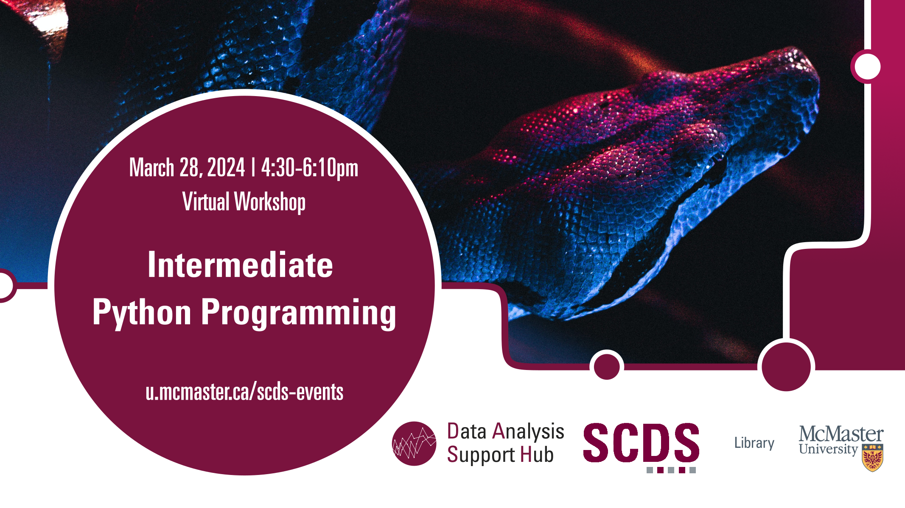

# Intermediate Python Programming

Python, a versatile and user-friendly programming language, has found widespread use among scientists for a variety of applications. This workshop will include a brief review of variable types before moving on to functions, Modules, Classes, and some of Python’s important science libraries.

## Facilitator Bio

Amirreza is a Master’s student in the Electrical and Computer Engineering department of McMaster University with 8 years of experience in different programming languages.

## Workshop Recording

<iframe height="416" width="100%" allowfullscreen frameborder=0 src="https://echo360.ca/media/8a8bae03-6e3c-489c-a3a5-4e2d5cbe8168/public"></iframe>

[View original here.](https://echo360.ca/media/8a8bae03-6e3c-489c-a3a5-4e2d5cbe8168/public)

## Links and Resources 

Access the workshop files here:
- [Google Colab](https://colab.research.google.com/drive/1AgANL7FpCJs1RizVRh5auPL7XtDgGcVN?usp=drive_link)