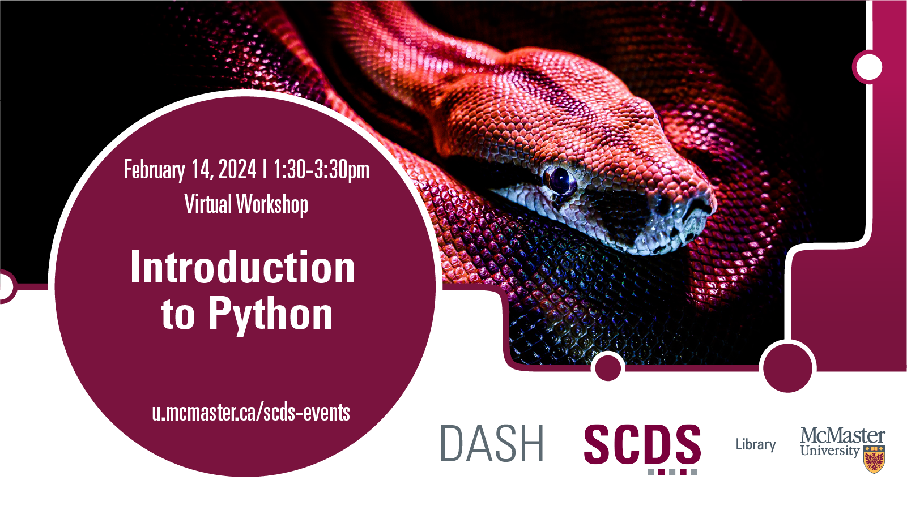

# Introduction to Python

This beginner level workshop will introduce you to the basic concepts of the world’s most popular Python programming language. You’ll learn to store data in Python data types and variables, as well as learn how to perform operations on numbers and strings. Python IDE Anaconda will be briefly discussed. No prior knowledge of Python is required. 

Facilitator Bio: Vivek Jadon (he/him) provides research support in the use of numeric research data. As part of his role, Vivek is McMaster University’s official representative for Statistics Canada’s Data Liberation Initiative (DLI) program and Inter-university Consortium for Political and Social Research (ICPSR). Both of these programs provide researchers with vast archive of research data from various disciplines for high quality research and instruction. Vivek is also involved in building awareness and promoting RDM activities/services at McMaster. Email Vivek at jadonvs@mcmaster.ca. 

**The materials for this workshop are available here:** <https://scds.github.io/intro-python/>

## Facilitator Bio
Vivek Jadon (he/him) provides research support in the use of numeric research data. As part of his role, Vivek is McMaster University’s official representative for Statistics Canada’s Data Liberation Initiative (DLI) program and Inter-university Consortium for Political and Social Research (ICPSR). Both of these programs provide researchers with vast archive of research data from various disciplines for high quality research and instruction. Vivek is also involved in building awareness and promoting RDM activities/services at McMaster. Email Vivek at jadonvs@mcmaster.ca. 
