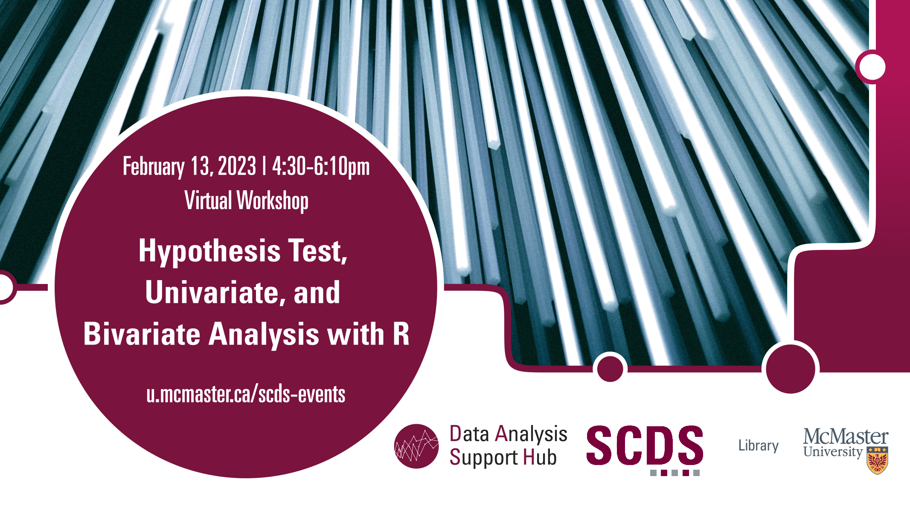

# Hypothesis Test, Univariate, and Bivariate Analysis with R

In this beginner-level session, participants will learn the fundamentals of conducting hypothesis tests and performing univariate analysis using the R statistical software. This session will cover essential aspects of hypothesis testing, data preparation, and exploratory univariate analysis. Prior expertise in hypothesis testing or R may not be required.

## Workshop Preparation 

R is required, and the relevant data may be provided prior to or during the event.

## Facilitator Bio

Humayun Kabir is a master’s student in Health Research Methodology at the Department of Health Research Methods, Evidence, and Impact at McMaster University. He provides support to the quantitative research data at the DASH, McMaster University Library.

## Workshop Recording

<iframe height="416" width="100%" allowfullscreen frameborder=0 src="https://echo360.ca/media/06bf0b7e-525f-4385-9a3e-2bb287419b34/public"></iframe>
[View original here.](https://echo360.ca/media/06bf0b7e-525f-4385-9a3e-2bb287419b34/public)

## Workshop Slides

<embed src="assets/docs/hypothesisTestSlides.pdf" style="border:none;" width="100%" height="466px">

[Download as PDF.](assets/docs/hypothesisTestSlides.pdf)