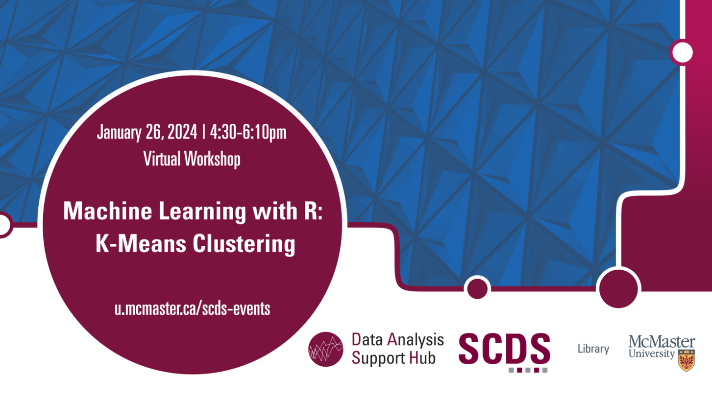

# Machine Learning with R: K-Means Clustering

This workshop will cover K-Means Clustering, a powerful machine-learning technique used for data segmentation and pattern recognition. K-Means is the most common clustering technique for unsupervised machine learning. 

**The recording and materials for this workshop are available here:** <https://scds.github.io/machine-learning-with-r/k-means.html>

## Facilitator Bio

Amirreza is a Master’s student in the Electrical and Computer Engineering department of McMaster University with 8 years of experience in different programming languages.
