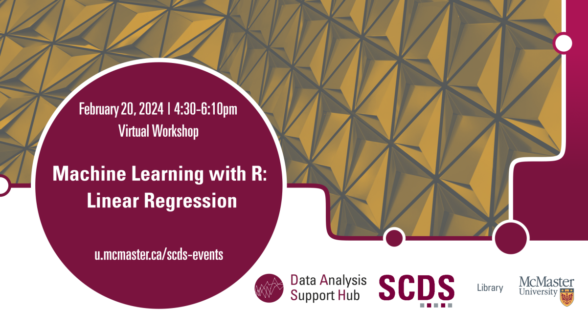

# Machine Learning with R: Linear Regression

In this beginner-level session, attendees will learn the fundamentals of using R programming for machine learning, with a specific focus on linear regression. Prior expertise in R or machine learning may not be required.

## Workshop Preparation 

R is required, and the relevant data may be provided prior to or during the event.

## Facilitator Bio

Humayun Kabir is a master’s student in Health Research Methodology at the Department of Health Research Methods, Evidence, and Impact at McMaster University. He provides support to the quantitative research data at the DASH, McMaster University Library.

## Workshop Recording

<iframe height="416" width="100%" allowfullscreen frameborder=0 src="https://echo360.ca/media/06e1cc14-f083-448b-9a68-9447085cbd9a/public"></iframe>

[View original here.](https://echo360.ca/media/06e1cc14-f083-448b-9a68-9447085cbd9a/public)

<!-- ## Workshop Slides

<embed src="assets/docs/k_means_clustering.pdf" style="border:none;" width="100%" height="466px">

[Download as PDF.](assets/docs/k_means_clustering.pdf) -->