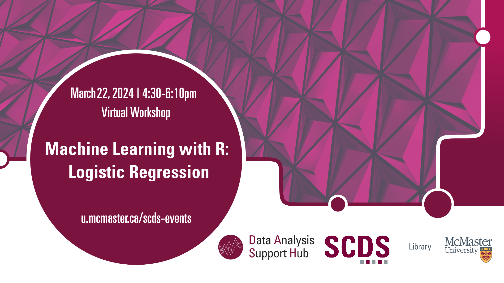

# Machine Learning with R: Logistic Regression

In this beginner-level session, attendees will learn the fundamentals of using R programming for machine learning, with a specific focus on logistic regression. No prior expertise in R or machine learning may be required.

**The recording and materials for this workshop are available here:** <https://scds.github.io/machine-learning-with-r/logistic-regression.html>

## Facilitator Bio

Humayun Kabir is a master’s student in Health Research Methodology at the Department of Health Research Methods, Evidence, and Impact at McMaster University. He provides support to the quantitative research data at the DASH, McMaster University Library.
