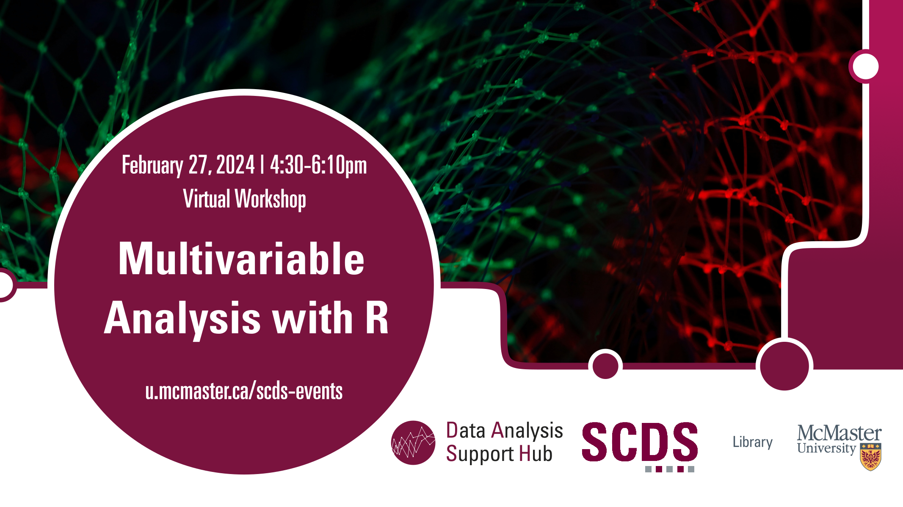

# Multivariable Analysis with R

In this beginner-level session, participants will learn the fundamentals of conducting multivariable analysis using the R statistical software. This session will cover essential aspects of multivariable analysis, including data preparation, regression techniques, and interpretation of results. Prior multivariable analysis or R expertise may not be required.

[Register for this workshop](https://libcal.mcmaster.ca/event/3761731){: .btn .btn-outline }

## Workshop Preparation 

R is required, and the relevant data may be provided prior to or during the event.

## Facilitator Bio

Humayun Kabir is a master’s student in Health Research Methodology at the Department of Health Research Methods, Evidence, and Impact at McMaster University. He provides support to the quantitative research data at the DASH, McMaster University Library.

<!-- # Workshop preparation 

Coming Soon
  
# Workshop Recording

Coming Soon

# Workshop Slides

Coming Soon

# Links and Resources 

Coming Soon -->
