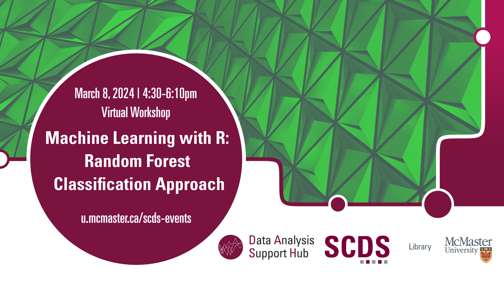

# Machine Learning with R: Random Forest Classification Approach

Join us for a workshop on Random Forest. Random Forest is an ensemble machine learning technique used for both classification and regression tasks. It is based on the concept of decision trees, where multiple decision trees are trained on different subsets of the data, and their predictions are combined to produce a more accurate and robust final prediction.

**The recording and materials for this workshop are available here:** <https://scds.github.io/machine-learning-with-r/random-forest.html>

## Facilitator Bio

Amirreza is a Master’s student in the Electrical and Computer Engineering department of McMaster University with 8 years of experience in different programming languages.
