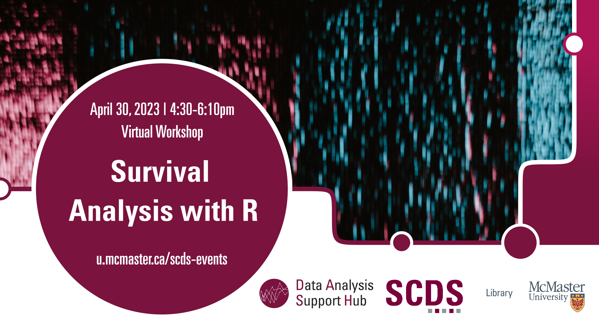

# Survival Analysis with R

In this beginner-level session, learners will explore the fundamentals of survival analysis using the R statistical software. The session will cover the basics of survival analysis, including data preparation, Kaplan-Meier survival curves, Cox proportional hazard models, and parametric hazard models. Survival analysis or R expertise may not be required.

## Workshop Preparation 

R is required, and the relevant data may be provided prior to or during the event.

## Facilitator Bio

Humayun Kabir is a master’s student in Health Research Methodology at the Department of Health Research Methods, Evidence, and Impact at McMaster University. He provides support to the quantitative research data at the DASH, McMaster University Library.

## Workshop Recording

<iframe height="416" width="100%" allowfullscreen frameborder=0 src="https://echo360.ca/media/7e7a7f92-7340-4bde-91a4-b6fdf19ef148/public"></iframe>

[View original here.](https://echo360.ca/media/7e7a7f92-7340-4bde-91a4-b6fdf19ef148/public)

## Links and Resources 

Access the workshop files here:
- [Google Colab](https://colab.research.google.com/drive/1M_azhc6CMmmvfSSzT1dY2gEDEixURT_q)