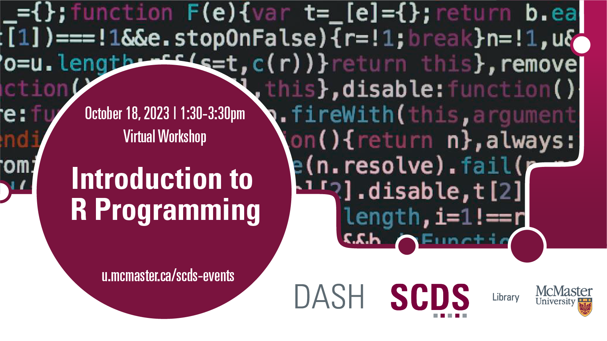

# Introduction to R Programming

This beginner-level workshop will focus on basic concepts of R programming using RStudio. Various Data Types and Data Structures will be discussed, as well as basic data analysis in R. No prior knowledge of R programming is required.

**The materials for this workshop are available here:** <https://scds.github.io/intro-r/>

## Facilitator Bio
Vivek Jadon (he/him) provides research support in the use of numeric research data. As part of his role, Vivek is McMaster University’s official representative for Statistics Canada’s Data Liberation Initiative (DLI) program and Inter-university Consortium for Political and Social Research (ICPSR). Both of these programs provide researchers with vast archive of research data from various disciplines for high quality research and instruction. Vivek is also involved in building awareness and promoting RDM activities/services at McMaster. Email Vivek at [vivek@mcmaster.ca](mailto:vivek@mcmaster.ca). 
