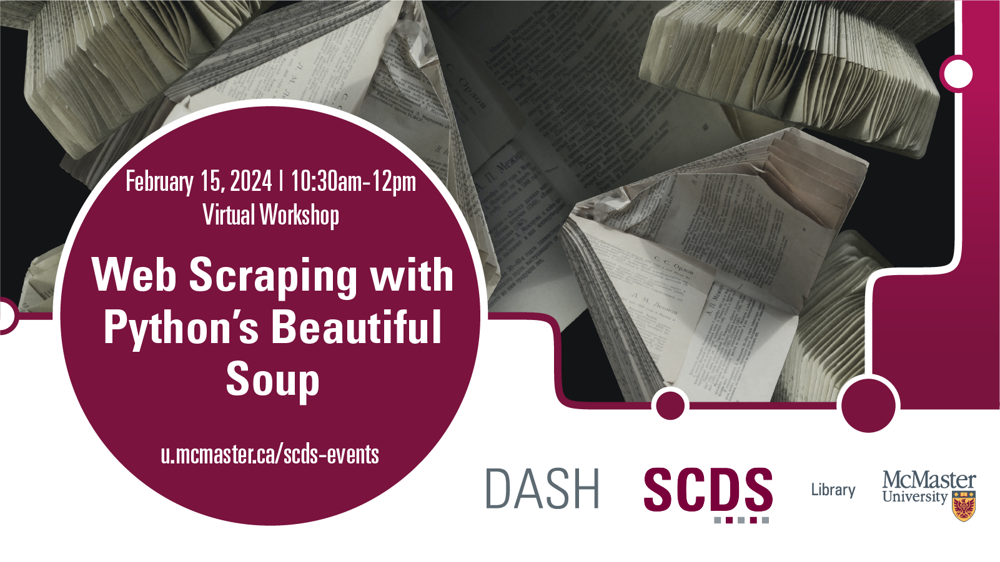

# Web Scraping with Python's Beautiful Soup

This workshop will introduce attendees to techniques for scraping information from the web using Python’s Beautiful Soup (bs4) toolkit. We will begin with a basic overview of the “anatomy” or structure of a webpage. Students will then learn how to write a script for extracting textual data from websites like Reddit and organizing it into spreadsheets. The second half of the workshop will explore how to use Python's Pandas library to clean and analyze your data. In addition to technical skills, students are encouraged to engage with critical questions like: What is web scraping for and what can we, as researchers, learn from publicly available data? What are the potential ethical and legal challenges of data harvesting, and how do we do it responsibly?

## Workshop Preparation 

A beginner knowledge of Python is necessary for this workshop. 
- Check out the Sherman Centre's [introductory asynchronous learning module on Python](https://scds.github.io/intro-python/) if you'd like to learn about Python.

## Facilitator Bio

Chelsea Miya is a Postdoctoral Fellow with the Sherman Centre for Digital Scholarship at McMaster University. Her research and teaching interests include critical code studies, nineteenth-century American literature, and the digital humanities. She has held research positions with the SpokenWeb Network, the Kule Research Institute (Kias), and the Canadian Writing Research Collaboratory (CWRC). She co-edited the anthology Right Research: Modelling Sustainable Research Practices in the Anthropocene (Open Book Publishers 2021), and her article “Student-Driven Digital Learning: A Call to Action” appears in People, Practice, Power: Digital Humanities outside the Center (MIT Press 2021).

## Workshop Recording

<iframe height="416" width="100%" allowfullscreen frameborder=0 src="https://echo360.ca/media/17339465-87cc-412f-a5a8-a1a51d668feb/public"></iframe>

[View original here.](https://echo360.ca/media/17339465-87cc-412f-a5a8-a1a51d668feb/public)